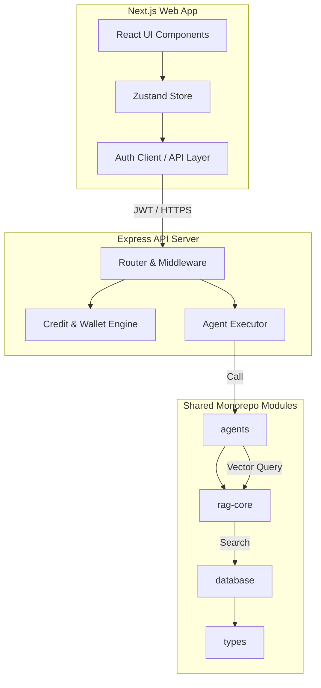

# Slide 1: Project Cover

## Creator Engine
*AI-Powered Startup Builder & AI Cofounder Platform*

- **GitHub Repository:** [github.com/Mina13323/creator-engine](https://github.com/Mina13323/creator-engine)
- **Team Members:**
  - Mina Wael
  - [Member]
  - [Member]
  - [Member]

---

# Slide 2: Project Idea & Feasibility

## 1. Project Description
Creator Engine is an end-to-end startup creation and execution platform. It guides entrepreneurs from initial brainstorming to execution:
- **Founder Profiling:** Matches founder skills with potential business ideas.
- **Opportunity Discovery:** Generates and ranks customized business opportunities.
- **Strategic Planning:** Automated generation of Lean Canvas, business plans, and SWOT analyses.
- **Financial Modeling:** Formulates cost structures, break-even charts, and pricing tiers.
- **Branding & Marketing:** Designs brand identity, voice guidelines, and multi-channel campaign copies.
- **Execution Tracking:** Operates a dynamic 30/60/90 day milestone roadmap.

## 2. Problem to be Solved
- **Validation Gap:** High startup failure rates due to lack of upfront market validation.
- **Access Constraints:** High consulting fees for professional market research and business modeling.
- **Execution Blindness:** Founders struggle to translate ideas into sequential, actionable tasks.
- **Local Context Deficit:** Generic AI models fail to adapt to local realities (e.g., Egyptian market constraints, purchasing power, mobile wallet payments, local competitors).

## 3. The Solution
An **AI Cofounder** that contextualizes startup generation using:
- **Founder Context Integration:** Inputs tailored skill sets, budgets, and location metrics.
- **Egypt Market Intelligence:** Embedded local regulations, payment infrastructure, and competitor lists.
- **Vector Search RAG:** Retrieves specialized knowledge bases to prevent hallucinated advice.
- **Agentic Workflows:** Operates multi-agent pipelines (via n8n or direct fallback) for targeted delivery.

## 4. Target Users
- **Primary:** Aspiring Entrepreneurs, Early-stage Startup Founders.
- **Secondary:** Graduation Students, Small Business Owners, Freelance Agencies.

## 5. Feasibility Study
- **Technical Feasibility:** 
  - Monorepo using Next.js/Express.js, powered by deep learning agents (Fireworks/Deepseek/Gemini).
  - MongoDB Atlas Vector Search utilizing `qwen3-embedding-8b` for domain grounding.
- **Business Feasibility (SaaS Model):**
  - Tiered subscription model (Free vs Premium plans).
  - Pay-as-you-go credit wallet model (e.g., 30 credits for a Business Plan, 40 for a Pitch Deck).
  - Direct regional payment integration using Paymob.

---

# Slide 3: System Features & Requirements

## 1. Functional Requirements
- **Secure Authentication:** JWT-based user sessions, secure cookies, and Google OAuth integration.
- **Founder Analyzer:** Evaluates experience and risk tolerance to map a customized founder profile.
- **Opportunity Ranking:** Generates startup ideas graded on Founder Fit, Market Demand, and MVP Timeline.
- **Business Plan Agent:** Structured Lean Canvas model generator detailing channels and customer needs.
- **Financial Forecast Engine:** 12-month revenue projection, cost category breakdowns, and EGP/USD break-even charts.
- **Branding Studio:** Custom color palettes, tone rules (Dos & Don'ts), taglines, and logo generation prompts.
- **Marketing Campaign Studio:** Social media strategy, content hooks, and ready-to-use platform ad copies.
- **Contextual Cofounder Chat:** Chatbot grounded in both RAG uploads (PDF/DOCX) and the generated Venture State.
- **Execution OS Dashboard:** Interactive 90-day task tracker (Todo/Doing/Done) calculating progress percentages.
- **AI Evaluation Engine:** Scores AI-generated output across 6 key metrics:
  - *Market Fit, Egypt Market Fit, Technical Feasibility, Financial Reality, Execution Clarity, Founder Alignment.*
- **Regional Payments:** Automatic wallet deductions, credit top-ups, and subscription management.

## 2. Non-Functional Requirements
- **Security:** Standard HTTP rate-limiters, Zod input validation schemas, and environment-secret masking.
- **Performance:** DB index optimization, parallel workflow execution, and direct Fireworks LLM fallbacks.
- **Scalability:** PNPM Monorepo splitting codebase into discrete backend applications and reusable packages.
- **Reliability:** Graceful error catching and automatic switching from offline n8n workflows to raw LLM models.
- **Maintainability:** Shared TypeScript interfaces, decoupled package architecture, and central store management.

## 3. Users & Roles
- **Founder (User):** Manages projects, executes generations, queries chat, updates roadmap.
- **Administrator (Admin):** Manages user accounts, reviews usage logs, flags content, inspects system analytics.

---

# Slide 4: Architecture & Project Structure

## 1. Technology Stack
- **Frontend:** Next.js (App Router), React, Tailwind CSS, Framer Motion, Zustand.
- **Backend:** Node.js, Express.js, MongoDB Atlas (Mongoose).
- **AI Core:** Fireworks AI API (Deepseek V4 / Qwen3 Embeddings), Google Gemini API (Fallback).
- **RAG & Search:** MongoDB Atlas Vector Search.
- **Integrations:** Cloudinary (Storage), Paymob (Payments), JWT (Authentication).

## 2. Monorepo Directory Layout
- **`apps/web/`**: Next.js single-page application and dashboard layouts.
- **`apps/api/`**: REST API endpoints, routing, authentication, and credit middleware.
- **`packages/agents/`**: Core multi-agent definitions (Founder, Opportunity, Plan, Brand, Market, Pitch, Evaluator, Execution).
- **`packages/database/`**: Mongoose models, indexing, connections, and system schemas.
- **`packages/rag-core/`**: Embedding generator, document chunking parsers, and local market intelligence search.
- **`packages/types/`**: Centrally shared TypeScript definitions across web and api services.

---

# Slide 5: Product Demo Flow

## Step-by-Step User Journey
1. **User Sign Up:** Secure email registration or Google single sign-on.
2. **Project Creation:** User initializes a project stating the industry focus and overall vision.
3. **Onboarding Questionnaire:** User defines budget, skill sets, location, and time constraints.
4. **Founder Profiling:** AI analyzes traits and assigns founder types (e.g., Technical, Operator) and recommended business categories.
5. **Venture Exploration:** Platform delivers ranked startup opportunities. User selects the best option to lock in the *Venture State*.
6. **Venture Generation:** AI compiles a comprehensive business plan with Lean Canvas and competitor lists.
7. **Asset Creation:**
   - *Financial Forecasting:* User reviews estimated budgets, startup costs, and monetization strategy.
   - *Branding:* AI details voice tone, positioning, logo prompts, and color guidelines.
   - *Marketing & Pitching:* AI drafts ad copies, marketing campaign channels, and slide-ready investor pitch decks.
8. **RAG Knowledge Ingestion:** User uploads supplemental domain files (PDF, DOCX, TXT) processed dynamically into vector chunks.
9. **Interactive Chat:** User consults the AI Cofounder regarding specific market conditions using contextual RAG.
10. **Roadmap Execution:** Execution OS structures tasks into a 30/60/90 day dashboard to track progress to launch.
